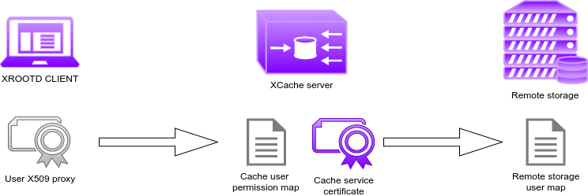

# CachingOnDemand Helm Chart

## What's XCache

XCache description is available in this article [here](https://iopscience.iop.org/article/10.1088/1742-6596/513/4/042044/pdf).

You can look at the [official XrootD documentation](http://xrootd.org/docs.html) for detailed information about the XRootD tool:

* [basic configuration](http://xrootd.org/doc/dev47/xrd_config.htm)
* [cmsd configuration](http://xrootd.org/doc/dev45/cms_config.htm)
* [proxy file cache](http://xrootd.org/doc/dev47/pss_config.htm)

## XCache components

The setup infrastructure is shown the figure below, where the clients that run the payload can be instructed to request data to a cache system deployed on the same cloud provider and thus with low latency. The cache stack consists in:

* __a proxy server__ to function as bridge between the private network of the cache and the client. This server will simply tunnel the request from cache servers.
* __a cache redirector__ for federating each cache server deployed. If a new server is added, it will be automatically configured to contact this redirector for registration
* __a configurable number of cache servers__, the core of the tool that are responsibles for reading-ahead from remote site while caching.

## AuthN/Z mode in XCache

### GSI

1. The client show its identity only to the cache server
2. The cache server will check in its local mapfile if the client is allowed to read the requested namespace
3. If that is the case the cache server will server the file from its disk if already cached or it will use its own certificate (robot/service/power user as needed) to authenticate with the remote storage for the reading process
4. The remote storage check its own mapfile if the robot/service/power user certificate is allowed to read from that namespace.

__N.B.__ a procedure to use a user proxy forwarding approach is available but not recomended for security reasons.

### AuthN/Z mode in XCache with OIDC

Coming soon...

## Deployment on Kubernetes with Helm

### Overview

### Values

| Value  | Default  | Description  | Type  |  
|---|---|---|---|
| gsi.enabled  | false  |  Enable GSI authentication  | boolean  |  
